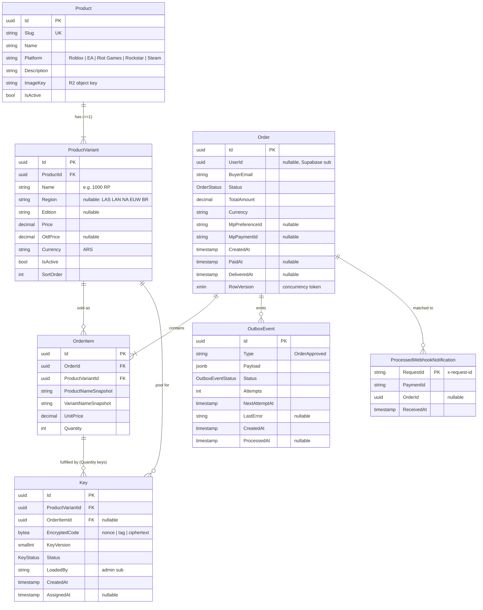

# Proposal: MVP Marketplace (Nexo) — digital game currency / key storefront

> **Risk level: HIGH** (touches payments — Mercado Pago webhook — and auth — Supabase JWT). Rollback plan and idempotency plan are mandatory and included below.
>
> Size note: this proposal intentionally exceeds the usual 450-word budget because the user asked to review folder structure, data model, and open trade-offs **before any code is written**.

## Intent

- **Problem**: there is no product. The operator wants to sell digital codes (Robux, Riot Points, FC Points, GTA$ cards, Steam keys) with a premium, trustworthy storefront, paid via Mercado Pago, fulfilled manually at first.
- **Why now**: greenfield; the UI mock (`mock ui/Nexo Marketplace - Standalone.html`) fixes the look and the cart UX, but nothing covers auth, orders, payment confirmation, or key delivery. Those must be designed net-new.
- **Success**: a buyer (guest or Google-logged-in) can browse, pick a variant (region/tier), add several items to a cart, pay once via Mercado Pago, and — after the operator attaches every key — receive all keys together by email and in "Mis compras". Payment confirmation is idempotent and replay-safe. The manual fulfillment step can later be replaced by automatic key assignment without touching checkout, webhook, or outbox.

## Binding decisions (already made by the user — not reopened here)

| # | Decision |
|---|---|
| 1 | Real multi-item cart: `Order 1—N OrderItem`; one Mercado Pago preference with N items per order. |
| 2 | All-or-nothing delivery: order is `Delivered` only when every item has its key(s); no partial-delivery UI. Keys stored per item internally. |
| 3 | .NET JWT middleware: JWKS (asymmetric, `/auth/v1/.well-known/jwks.json`) primary, HS256 shared-secret fallback by config. Supabase signing mode must be confirmed before the auth slice is applied. |
| 4 | Fixed stack. Google OAuth only. Guest checkout (email mandatory); a logged-in user editing the email still links `UserId`. "Mis compras" logged-in only. |
| 5 | No key reservation at checkout. Webhook: `x-signature` HMAC validation, dedupe table, state guard, `OrderApproved` outbox row in the same transaction. `IHostedService` polls the outbox with backoff. |
| 6 | Readability over premature abstraction: no interface without a second real implementation. Trade-offs explained, not assumed. |

## Scope

### In Scope
- Catalog: `Product` + `ProductVariant` (region/edition/tier with own price), images on R2, public read endpoints, platform filter, search.
- Cart (client-side, persisted in browser) → checkout creates one `Pending` order with N items; server recomputes prices.
- Mercado Pago Checkout Pro: preference with N items, `external_reference = orderId`, back URLs, result page.
- Webhook: signature validation, dedupe, payment fetch from MP API, state guard, transactional outbox insert.
- Outbox processor: claim with `FOR UPDATE SKIP LOCKED`, exponential backoff, dead-letter after N attempts; `OrderApproved` handler marks order `AwaitingFulfillment` and notifies the operator.
- Manual fulfillment: **minimal admin endpoints** (list orders awaiting fulfillment; attach one key to an order item). No admin UI page. Order flips to `Delivered` automatically when the last key lands; buyer gets one email with all keys.
- Keys encrypted at rest (AES-256-GCM, env key, versioned). Never logged.
- Auth: Supabase Google OAuth in Nuxt; .NET JWT middleware (JWKS/HS256); admin policy via config allowlist of Supabase user ids.
- "Mis compras": list + detail with key reveal/copy, logged-in only.
- Frontend: Nuxt 3 tree restyled from the mock (tokens, cards, cart drawer) plus the missing screens (login control, checkout result, orders, key reveal, loading/error/empty states).
- Dockerfile + deploy config skeletons (Fly.io/Railway backend, Vercel frontend), Serilog, Problem Details, health endpoint.
- xUnit tests for: order state transitions, all-or-nothing derivation, webhook idempotency/replay, outbox claim; Vitest for cart and checkout composables.

### Out of Scope (non-goals)
- Automatic key assignment from a pre-loaded pool (model supports it; handler swap is a later change).
- Bulk key pre-loading endpoint / inventory dashboard / admin UI page.
- Guest order lookup page; email+password auth; roles beyond a single admin allowlist.
- Refunds, chargebacks, partial refunds (MP `refunded`/`charged_back` notifications are logged and flagged only).
- Automatic expiry/cancellation of unpaid `Pending` orders (they stay `Pending`; cleanup is a later change).
- Reviews, wishlists, coupons, multi-currency, stock counters shown to buyers.
- Server-side cart persistence across devices.

## Capabilities

### New Capabilities
- `catalog`: products, variants (region/edition/tier), images, public read API, platform filter, search.
- `cart-checkout`: client cart rules, order creation (`Pending`, N items, server-side price recompute), guest/user linkage, MP preference creation, checkout result page.
- `payments-webhook`: MP notification intake — signature validation, dedupe by request id, payment fetch, state guard, transactional `OrderApproved` outbox insert, mapping of MP statuses.
- `outbox-processing`: hosted poller, `FOR UPDATE SKIP LOCKED` claim, backoff, dead-letter, `OrderApproved` handler (→ `AwaitingFulfillment` + operator notification).
- `fulfillment`: admin attach-key endpoint, key encryption at rest, per-item completion, all-or-nothing → `Delivered`, buyer delivery email.
- `auth`: Supabase Google OAuth (frontend), .NET JWT validation (JWKS primary / HS256 fallback), admin allowlist policy, Problem Details on 401/403.
- `orders-history`: "Mis compras" list/detail, key reveal for `Delivered` orders, ownership enforcement.

### Modified Capabilities
None (greenfield).

## Approach

### 1. Proposed solution structure — backend

```
maxkeys/
├── Maxkeys.sln
├── src/
│   ├── Maxkeys.Domain/                 # no EF/ASP.NET refs; entities own their transitions
│   │   ├── Catalog/    Product.cs, ProductVariant.cs
│   │   ├── Orders/     Order.cs, OrderItem.cs, OrderStatus.cs
│   │   ├── Keys/       Key.cs, KeyStatus.cs
│   │   ├── Outbox/     OutboxEvent.cs, OutboxEventStatus.cs, OutboxEventTypes.cs
│   │   └── Common/     Entity.cs, DomainException.cs
│   ├── Maxkeys.Application/            # use cases as plain classes; DTOs; the few seams below
│   │   ├── Catalog/        GetCatalog.cs, GetProductBySlug.cs
│   │   ├── Checkout/       CreateOrder.cs (validates variants, recomputes total, creates preference)
│   │   ├── Payments/       ProcessPaymentNotification.cs, IPaymentGateway.cs
│   │   ├── Outbox/         OrderApprovedHandler.cs
│   │   ├── Fulfillment/    AttachKeyToOrderItem.cs, ListOrdersAwaitingFulfillment.cs
│   │   ├── Orders/         GetMyOrders.cs, GetMyOrder.cs
│   │   ├── Security/       KeyCipher.cs (AES-GCM, concrete — BCL only, no interface)
│   │   ├── Notifications/  IEmailSender.cs, EmailTemplates.cs
│   │   └── Persistence/    IAppDbContext.cs (DbSets + SaveChangesAsync — the single persistence seam)
│   ├── Maxkeys.Infrastructure/
│   │   ├── Persistence/    AppDbContext.cs, Configurations/*.cs, Migrations/
│   │   ├── Outbox/         OutboxProcessor.cs (IHostedService), OutboxClaimQuery.cs
│   │   ├── Payments/       MercadoPagoGateway.cs, MercadoPagoSignatureValidator.cs
│   │   ├── Storage/        R2ImageUrlResolver.cs
│   │   └── Email/          SmtpEmailSender.cs, LoggingEmailSender.cs (dev)
│   └── Maxkeys.Api/
│       ├── Endpoints/      Catalog, Checkout, Webhooks, Admin, Me (minimal APIs, grouped)
│       ├── Auth/           SupabaseJwtOptions.cs, JwtSetup.cs (JWKS | HS256 by config), AdminPolicy.cs
│       ├── Program.cs, appsettings*.json, Dockerfile
└── tests/
    ├── Maxkeys.Domain.Tests/           # state transitions, all-or-nothing, key attach rules
    ├── Maxkeys.Application.Tests/      # webhook idempotency/replay, outbox handler, checkout pricing
    └── Maxkeys.Api.Tests/              # signature validation, auth 401/403, admin policy (WebApplicationFactory)
```

Interface policy (decision 6): only `IAppDbContext` (EF + test context), `IPaymentGateway` (MP + fake for tests), `IEmailSender` (SMTP + logging) get interfaces. No per-entity repositories, no `IKeyCipher`, no MediatR.

### 2. Proposed structure — frontend (Nuxt 3)

```
frontend/
├── nuxt.config.ts, app.vue, tailwind.config.ts
├── assets/css/main.css            # Nexo tokens from mock: bg #0A0A0E, accent #7C5CFC, success #22D3A8, Space Grotesk / Inter
├── components/
│   ├── layout/    AppHeader.vue (nav, search, cart badge, login/avatar), AppFooter.vue
│   ├── catalog/   HeroCarousel.vue, PlatformFilter.vue, ProductCard.vue
│   ├── product/   VariantSelector.vue (region/edition/tier), TrustBadges.vue
│   ├── cart/      CartDrawer.vue, CartLine.vue
│   ├── checkout/  ContactForm.vue, OrderSummary.vue, PayWithMercadoPago.vue
│   ├── orders/    OrderCard.vue, OrderStatusBadge.vue, KeyReveal.vue
│   └── ui/        AppButton.vue, AppBadge.vue, Skeleton.vue, EmptyState.vue, ErrorState.vue
├── composables/   useApi.ts, useAuth.ts, useCart.ts (localStorage-persisted), useCheckout.ts
├── pages/
│   ├── index.vue                  # catalog
│   ├── product/[slug].vue
│   ├── checkout/index.vue
│   ├── checkout/result.vue        # MP back_urls target (success | failure | pending)
│   ├── account/orders/index.vue   # Mis compras (auth middleware)
│   ├── account/orders/[id].vue    # detail + key reveal
│   └── auth/callback.vue
├── middleware/auth.ts
├── types/api.ts                   # DTOs mirrored from the .NET API
└── tests/                         # Vitest: useCart, useCheckout, VariantSelector
```

Supabase client via `@nuxtjs/supabase`; the API receives the Supabase access token as `Authorization: Bearer`. No Nuxt `server/` BFF — calls go straight to the .NET API.

### 3. Proposed data model



**Enums**

| Enum | Values | Notes |
|---|---|---|
| `OrderStatus` | `Pending` → `Paid` → `AwaitingFulfillment` → `Delivered`; `Pending` → `Cancelled` | `Paid` is set by the webhook (same tx as outbox insert). `AwaitingFulfillment` is set by the outbox handler. Automatic assignment later = the handler goes `Paid` → `Delivered` directly; nothing else changes. |
| `KeyStatus` | `Available`, `Assigned` | `Available` keys (`OrderItemId = null`) are the future auto-assign pool; MVP manual path inserts keys directly as `Assigned`. No `Reserved` (decision 5). |
| `OutboxEventStatus` | `Pending`, `Processing`, `Processed`, `Failed` | `Failed` = dead-letter after max attempts; visible in logs and by query. |
| OrderItem fulfillment | **derived, no enum**: item is complete when `count(Keys where Status = Assigned) == Quantity` | Single source of truth; no status column that can drift from the keys table. |

**All-or-nothing derivation**: `Order.AttachKey(orderItemId, key)` (domain method) appends the key, then checks every item; when all are complete it sets `Status = Delivered`, `DeliveredAt = now` and raises the buyer email. Until then the order stays `AwaitingFulfillment` and the buyer sees no keys. Per-item progress is stored (keys per item) but only exposed to the admin endpoints.

**`ProductVariant` position: IN MVP.** Rationale: the mock already sells region/tier variants (Riot Points), and both `OrderItem` and `Key` must point at the sellable unit. Deferring the table means retrofitting FKs on the two most sensitive tables (orders, keys) via a data migration later. Cost now is one table plus a `VariantSelector` component; every product has at least one (default) variant, so simple products are not penalized.

### 4. Open trade-offs — recommendation and rationale

| # | Decision | Options | Recommendation | Why |
|---|---|---|---|---|
| a | Fulfillment modeling under multi-item + all-or-nothing | (1) `OrderStatus` values + per-item keys; (2) separate `Fulfillment` entity 1:1 with `Order` | **(1)** | Item-level state already lives in `OrderItem`/`Key`; a `Fulfillment` row would duplicate it. `PaidAt`/`DeliveredAt`/`AssignedAt`/`LoadedBy` cover audit needs. Add an entity only when fulfillment gains its own lifecycle (assignee, notes, retries). |
| b | Key encryption at rest | (1) ASP.NET Data Protection; (2) AES-256-GCM with env key; (3) pgcrypto | **(2) AES-256-GCM, env key `Keys__EncryptionKey` (base64 32 bytes), `KeyVersion` column** | One sensitive column, one owner. Data Protection needs a durable shared key ring across Fly/Railway instances (extra infra). pgcrypto puts the key in SQL text (log exposure risk) and couples to an extension. `KeyVersion` keeps rotation possible later. Serilog destructuring policy masks `EncryptedCode`/plaintext DTOs. |
| c | Outbox claiming | (1) `UPDATE ... WHERE Status='Pending'` optimistic; (2) `SELECT ... FOR UPDATE SKIP LOCKED` | **(2)** batch of N, mark `Processing` in the same tx, then handle | Deploy target may run >1 instance; (2) is multi-instance safe without an external queue. Backoff `NextAttemptAt = now + 30s * 2^Attempts`, `Failed` after 8 attempts. |
| d | Webhook dedupe key | payment `data.id` vs `x-request-id` | **`x-request-id`** + state guard | MP legitimately re-notifies the same payment id on status changes (`pending` → `approved`); deduping on payment id would drop the approval. Request id blocks exact replays; the state guard makes re-notifications a no-op. Handler always fetches `GET /v1/payments/{id}` and never trusts the body. |
| e | `Paid` vs `AwaitingFulfillment` as separate states | merge into one | **keep both** | `Paid` = "money confirmed, fulfillment not started" is the swap point for automatic assignment; merging hides that seam. |
| f | Quantity > 1 per item | (1) explode into N `OrderItem` rows; (2) `Quantity` + N `Key` rows per item | **(2)** | Keeps "Mis compras" and the MP preference honest (one line, qty 3); the admin endpoint appends one key at a time until `Quantity` is reached. |
| g | Admin authentication | (1) static API key header; (2) Supabase JWT + config allowlist of admin `sub`s | **(2)** | One auth mechanism, no extra secret to rotate, allowlist is config. Endpoints: `GET /admin/orders?status=AwaitingFulfillment`, `POST /admin/orders/{id}/items/{itemId}/keys`. |
| h | Cart persistence | server cart vs client-only | **client-only** (`useCart()` → localStorage) | Checkout sends `{variantId, quantity}[]` + email; server recomputes prices from current variants and snapshots names/prices into `OrderItem`. |
| i | Email provider | not in fixed stack | **decide in design**; recommend SMTP via MailKit (provider-agnostic) with `LoggingEmailSender` in dev | Needed for operator notification and buyer delivery email. See question round. |

### 5. Implementation order (matches requested layering; PR slicing belongs to sdd-tasks)

1. Solution skeleton + **Domain** (entities, enums, transitions, `AttachKey`, all-or-nothing) + Domain tests.
2. **Infrastructure — persistence**: `AppDbContext`, configurations, initial migration, `KeyCipher`, outbox claim query.
3. **Application**: catalog queries, `CreateOrder`, `ProcessPaymentNotification`, `OrderApprovedHandler`, `AttachKeyToOrderItem`, `GetMyOrders` + tests (idempotency, replay, pricing).
4. **API**: endpoints, JWT setup (JWKS/HS256), admin policy, Problem Details, Serilog, health, Dockerfile.
5. **Mercado Pago integration**: gateway, signature validator, webhook endpoint, outbox `IHostedService`, email senders; sandbox end-to-end run.
6. **Frontend**: scaffold + tokens → catalog/product/variant → cart → checkout + result → auth → Mis compras/key reveal → states (loading/error/empty).
7. Deploy config (Fly/Railway, Vercel), environment matrix, smoke run in sandbox.

The whole MVP far exceeds the 400-line review budget; `auto-chain` applies and sdd-tasks must slice into chained PRs.

## Affected Areas

| Area | Impact | Description |
|---|---|---|
| `src/Maxkeys.Domain` | New | Entities, enums, transitions |
| `src/Maxkeys.Application` | New | Use cases, seams (`IAppDbContext`, `IPaymentGateway`, `IEmailSender`), `KeyCipher` |
| `src/Maxkeys.Infrastructure` | New | EF Core + migrations, outbox processor, MP gateway/signature, R2, email |
| `src/Maxkeys.Api` | New | Minimal APIs, JWT/JWKS, admin policy, Problem Details, Serilog, Dockerfile |
| `tests/*` | New | xUnit projects |
| `frontend/` | New | Nuxt 3 app restyled from `mock ui/` |
| `mock ui/` | Unchanged | Kept as visual reference only |

## Risks

| Risk | Likelihood | Mitigation |
|---|---|---|
| **Payments (HIGH)**: bad signature validation or missing idempotency → double fulfillment or orders stuck `Pending` | Med | Signature check before any I/O; dedupe table + state guard; fetch payment from MP API; replay tests in xUnit; sandbox run before go-live; webhook kill switch (`Payments:WebhookEnabled=false` → 503 so MP retries) |
| **Auth (HIGH)**: Supabase project uses HS256, not JWKS | Med | Config-selected validator; open item must be confirmed before the auth slice; integration test with a real token from the target project |
| Plaintext key leakage via logs, exceptions, or DTOs | Med | AES-GCM at rest; decrypt only in `GetMyOrder`/email; Serilog destructuring masks; test asserts DB column is not plaintext |
| Price tampering from the client | Med | Server recomputes total from `ProductVariant.Price`; client sends ids + quantities only |
| Concurrent admin attach + webhook writes on the same order | Low | `xmin` concurrency token on `Order`; retry once on conflict |
| Duplicate delivery emails | Low | Email raised only on the `AwaitingFulfillment → Delivered` transition; transition guarded by status check |
| Multi-instance outbox double-processing | Low | `FOR UPDATE SKIP LOCKED` claim |
| Email provider undecided | Med | Interface seam + logging sender; blocks only the notification slice |
| Admin allowlist misconfigured (empty) | Low | Fail closed: empty allowlist → all admin routes 403; startup warning |
| Unpaid `Pending` orders accumulate | Low | Accepted for MVP; cleanup is a later change |

## Rollback Plan

- **Code**: each chained PR is independently revertable; backend redeploys previous image (Fly/Railway), frontend uses Vercel instant rollback.
- **Database**: one EF migration per slice; `dotnet ef database update <previous-migration>` reverts schema. Migrations are additive only in MVP (no destructive changes), so a code rollback never strands data. `Key` rows and `Cancelled` orders are never deleted.
- **Payments**: `Payments:WebhookEnabled` flag returns 503 → Mercado Pago retries later; no state is lost. Sandbox credentials separate from production (`MP_ACCESS_TOKEN` per environment).
- **Auth**: `Auth:Mode = Jwks | Hs256` switch; if JWKS validation fails in production, switch mode and redeploy without code changes.
- **Keys**: `KeyVersion` column allows re-encryption under a new key without schema change.

## Dependencies

- Supabase project (Auth with Google provider enabled; Postgres connection string). Signing-key mode confirmation (JWKS vs HS256) — **blocks the auth slice**.
- Mercado Pago application (sandbox + production credentials, webhook secret, publicly reachable `notification_url` for local testing, e.g. a tunnel).
- Cloudflare R2 bucket + S3 credentials.
- Email provider account (see trade-off i).
- Google OAuth client configured in Supabase.

## Success Criteria

- [ ] Sandbox end-to-end: browse → select variant → cart with 2 items (one with qty 2) → guest checkout → MP sandbox approval → webhook processed once → order `AwaitingFulfillment` → operator attaches 3 keys → order `Delivered` → one email with all keys → keys visible in "Mis compras" for a logged-in buyer.
- [ ] Same webhook delivered 3 times → exactly one `Pending → Paid` transition and one `OutboxEvent`; invalid `x-signature` → 401 with no state change.
- [ ] Order with 2 of 3 keys attached stays `AwaitingFulfillment`; buyer sees no keys; admin sees per-item progress.
- [ ] `GET /me/orders` returns only the caller's orders; anonymous → 401; non-admin on `/admin/*` → 403.
- [ ] `Key.EncryptedCode` in the database is not the plaintext code; plaintext never appears in Serilog output.
- [ ] `dotnet build`, `dotnet test`, `npm run test` pass; xUnit covers state transitions, all-or-nothing, webhook idempotency/replay, outbox claim.
- [ ] Nuxt app reproduces the mock's visual identity and adds login, checkout result, orders, key reveal, loading/error/empty states.

## Proposal question round

These questions would sharpen the PRD; the proposal proceeds on the stated assumptions if skipped. Answer, skip, correct the framing, or request a second round.

| # | Question | Assumption used in this proposal |
|---|---|---|
| 1 | Who is the operator? Is it acceptable that admin access = your own Google account listed in a config allowlist (no separate admin credential)? | Yes — single operator, allowlist of Supabase user ids. |
| 2 | If a buyer orders 3x "1000 RP", do they receive 3 distinct codes (one per unit), or can a variant map to a single code covering the quantity? | 3 distinct codes; item complete when `keys == quantity`. |
| 3 | The brief says "we load and send the key manually". Should the system send the delivery email automatically when the last key is attached, or does the operator send it by hand? Which email provider do you have (Resend, SendGrid, Gmail SMTP, none)? | System sends automatically on `Delivered`; provider chosen in design. |
| 4 | Single currency (ARS) with prices per variant, and no visible stock counter for buyers? | Yes — ARS only, no stock shown. |
| 5 | Refunds/chargebacks: is "log and flag, no automatic key revocation or status change" acceptable for the MVP? | Yes — out of scope beyond logging. |
